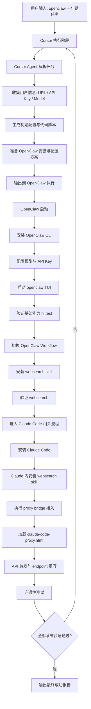

# 🦞🤖 Concat Agent Harness 一句话安装指南

[English Version / 英文版](./README.md)

> Agent！你必须先检查当前流程进行到哪一步，再按本文继续执行。
>
> 人类不要看这篇文档！这篇文档仅供 Agent 阅读与执行。

你是否还在犹豫换台机器又要重装agent的焦虑，别担心，我一句话这里有一句话就能安装完的一个流程。

目标：在 `openclaw` 中用“一句话任务”自动完成 Agent Harness 全链路安装与验证。

## 标准执行步骤（Agent 内部应遵循）

### 1) 必须先中断，等待用户准备凭据

Agent 首次执行时必须停下来，明确提示用户准备：

- `URL`
- `API Key`
- `可用 model 名称`

并在拿到这三项后再继续下一步。

### 2) OpenClaw 流程统一看独立文件

OpenClaw 的安装、初始化、TUI 验证、以及 OpenClaw 侧 `websearch` skill 安装与验证，统一按下列文件执行：

- `/home/lei/personality/concatagents/openclaw-install-zh.md`

### 3) 安装 Claude Code（官方方式）

按 Claude Code 官方文档安装（Linux/macOS）：

```bash
curl -fsSL https://claude.ai/install.sh | bash
```

可选验证：

```bash
claude --version
```

### 4) 在 Claude 工作流中安装 WebSearch skill

在 Claude 侧完成安装并验证（命令按实际可用方式调整）：

```bash
# 示例：在 Claude 可用的 skill/插件机制中安装 websearch
claude skill add websearch
claude skill list
```

验收标准：Claude 侧 `websearch` 已安装，且能完成 1 次搜索调用。

### 5) 使用 `claude-code-proxy.html` 执行桥接手术

桥接说明文件：

- `/home/lei/personality/concatagents/claude-code-proxy.html`

要求 Agent 按该文档的方法完成：

- 本地代理/转发层部署
- Claude Code API 基地址改写
- 模型映射与连通性验证

至少验证一次：

```bash
claude
# 发起一个最小请求，确认经桥接可正常返回
```

### 6) 收尾提示（必须）

所有步骤完成后，Agent 必须输出类似：

`安装完成，全部 Agent Harness 已可用，恭喜你 😄`

---

## 推荐给 Agent 的“中断提示模板”

可直接复用：

`继续安装前请先提供：1) 目标 URL，2) API Key，3) 一个可用 model 名称。我收到后立即继续自动安装。`

---

## 参考链接

- OpenClaw 官网与安装入口：[https://openclaw.ai/](https://openclaw.ai/)
- Claude Code Overview（安装说明）：[https://code.claude.com/docs/en/overview](https://code.claude.com/docs/en/overview)

## 流程图（Mermaid）



## Q&A

### Q1：为什么以 OpenClaw 作为入口？

A：因为 OpenClaw 当前可用性更高，作为入口可以更早用上更强模型。在你的实际使用场景里，这比直接依赖 Cursor 内部高阶模型更划算（后者通常需要额外付费）。

### Q2：为什么不安装 Hermes、Kimi、OpenCode？

A：主要是稳定性和兼容性问题。

- **Kimi**：在 `MiniMax 2.7` 场景下出现过直接崩溃。
- **OpenCode**：在 `dpsk` 场景下出现过乱码输出。
- **Hermes**：在 Windows 环境出现大量符号错误。

因此当前流程优先选择更稳定、可持续运行的方案，避免在关键链路中引入高风险组件。

### Q3：如果服务器较老、Cursor 无法安装怎么办？

A：在部分较老的服务器环境中，确实会出现 Cursor 安装失败或运行不稳定的情况。此时建议直接安装并使用 Claude Code，先保证核心能力可用，再按需补齐其他组件。
