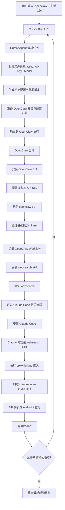

# 🦞🤖☤ Concat Agent Harness 一句话安装指南

[Agent 要求] 在执行任何安装前，你必须先让用户选择要安装哪些 agent。当前选项：`openclaw`、`claude code`、`hermes`。

[English Version / 英文版](./README.md)

> Agent！你必须先检查当前流程进行到哪一步，再按本文继续执行。
>
> 人类不要看这篇文档！这篇文档仅供 Agent 阅读与执行。

担心每次换机器都要把整套 agent 重新装一遍？不用担心。这个指南的目标就是让你用一句话触发完整安装流程。

### 预先准备

1. 与 `concatagents/` 目录同级须有 [`../model.json`](../model.json)（相对本 README 为上一层），在其中写好 **URL / `baseUrl`**、**API Key** 及模型等必要字段（勿将真实密钥提交到公开仓库）。

**目标：** 从一句 `openclaw` 风格的指令完成整个 Agent Harness 安装与配置流程，并最终达到可以成功通过 [`verify/agent-model-repair`](./verify/agent-model-repair/) 验证的状态；**尽量减少反复的人工卡点**。

### Agent 收尾填报表（必须）

流程末尾由执行 Agent 根据验收结果，**在回复或交付说明中**向用户展示与**下方同结构**的表格（单元格填 `是` / `否` / `不适用`）。**不得**修改、提交对本 README 内下列空白模板的任何 git 改动；模板原样保留，仅把填好的版本**另外输出给用户**即可。

| Harness 组件 | 是否安装 | 是否验收通过 | CLI 可用（无交互自检） | 是否输出hi |
|----------------|----------|----------------|------------------------|------------|
| OpenClaw | | | | |
| Claude Code | | | | |
| Hermes | | | | |

## 标准执行步骤（Agent 内部应遵循）

### 1) Hermes 安装流程

Hermes 的安装与使用流程，统一按下列文件执行：

- [`hermes-guide-zh.md`](./hermes-guide-zh.md)（与本 README 同目录）

### 2) 安装 Claude Code（官方方式）

按 Claude Code 官方文档安装（Linux/macOS）：

```bash
curl -fsSL https://claude.ai/install.sh | bash
```

优先由 **Agent / 自动化** 尝试完成 Claude Code 首次初始化：例如依赖已导出的 **`ANTHROPIC_API_KEY`**（或等价凭据）走无头/非交互路径，或在官方支持的前提下尝试可脚本化的登录流程。**仅当**无法自行登录、且也无法仅靠配置或轮换密钥完成初始化时，才暂停并请用户在本机**手动**运行一次 `claude`，完成浏览器登录等首启引导。初始化成功后，Agent 再继续后续流程。

可选验证：

```bash
claude --version
```

### 3) 在 Claude 工作流中安装 WebSearch skill

在 Claude 侧完成安装并验证（命令按实际可用方式调整）：

```bash
# 示例：在 Claude 可用的 skill/插件机制中安装 websearch
claude skill add websearch
claude skill list
```

验收标准：Claude 侧 `websearch` 已安装，且能完成 1 次搜索调用。

### 4) 使用 `claude-code-proxy.html` 执行桥接手术

桥接说明文件：

- [`claude-code-proxy.html`](./claude-code-proxy.html)

**说明：** 按用户提供的 API Key 和 URL 完成配置即可。

要求 Agent 按该文档的方法完成：

- 本地代理/转发层部署
- Claude Code API 基地址改写
- 模型映射与连通性验证

至少验证一次：

```bash
claude
# 发起一个最小请求，确认经桥接可正常返回
```

### 5) 收尾提示（必须）

所有步骤完成后，Agent 必须输出类似：

`安装完成，全部 Agent Harness 已可用，恭喜你 😄`

---

## 推荐给 Agent 的“中断提示模板”

可直接复用：

`继续前请确认 ../model.json 已含 baseUrl、API Key 与模型等字段；并说明要安装或启用的 agent：openclaw / claude code / hermes 中的哪几项。`

---

## 参考链接

- OpenClaw 官网与安装入口：[https://openclaw.ai/](https://openclaw.ai/)
- Claude Code Overview（安装说明）：[https://code.claude.com/docs/en/overview](https://code.claude.com/docs/en/overview)


## 流程图（Mermaid）



## 自动化验证（Agent / CI）

在自动化验证场景下，Agent / CI 应自动调用以下 skill：

- `verify/agent-model-repair/`：
  当验证阶段出现模型 / 认证 / 端点类故障时（例如 `401`、`400 unsupported`、模型路由损坏，或 OpenClaw / Claude / Hermes 对同一模型状态判断不一致），应自动调用该 skill。它负责诊断问题、在可能时修复本地配置链路、重新执行验证，并在回复或交付说明中输出必需的 Harness 收尾验收表。

推荐触发时机：

- 自动化验证过程中任一 provider / model 检查失败时
- 多 agent 之间模型可用性不一致时

## Q&A

### Q1：为什么以 OpenClaw 作为入口？

A：因为 OpenClaw 在当前流程里的实际可用性更高。先从它切入，通常能更早用上更强模型。在很多真实使用场景下，这比直接依赖 Cursor 内部高阶模型更划算（后者往往需要额外付费）。

### Q2：为什么不安装 Hermes、Kimi、OpenCode？

A：主要是稳定性和兼容性风险。

- **Kimi**：在 `MiniMax 2.7` 场景下观察到过直接崩溃。
- **OpenCode**：在 `dpsk` 场景下观察到过乱码输出。
- **OpenClaw**：在 Windows 环境中观察到过运行时问题。

因此当前流程优先选择在关键链路上更稳定、可持续运行的组件。

### Q3：如果服务器较老、Cursor 无法安装怎么办？

A：在较老的服务器环境中，Cursor 可能安装失败或运行不稳定。此时建议先直接安装并使用 Claude Code，先保证核心能力可用，再按需补齐其他组件。