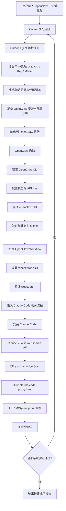

# 🦞🤖☤ Concat Agent Harness 一句话安装指南

[Agent 要求] 在执行任何安装前，你必须先让用户选择要安装哪些 agent。当前选项：`openclaw`、`claude code`、`hermes`。

[English Version / 英文版](./README.md)

> Agent！你必须先检查当前流程进行到哪一步，再按本文继续执行。
>
> 人类不要看这篇文档！这篇文档仅供 Agent 阅读与执行。

你是否还在犹豫换台机器又要重装agent的焦虑，别担心，我一句话这里有一句话就能安装完的一个流程。

### 预先准备

1. 与 `concatagents/` 目录同级须有 [`../model.json`](../model.json)（相对本 README 为上一层），在其中写好 **URL / `baseUrl`**、**API Key** 及模型等必要字段（勿将真实密钥提交到公开仓库）。

**目标：** 在 `openclaw` 中用「一句话任务」自动完成 Agent Harness 全链路安装与验证；**尽量减少反复的人工卡点**。

### Agent 收尾填报表（必须）

流程末尾由执行 Agent 根据验收结果，**在回复或交付说明中**向用户展示与**下方同结构**的表格（单元格填 `是` / `否` / `不适用`）。**不得**修改、提交对本 README 内下列空白模板的任何 git 改动；模板原样保留，仅把填好的版本**另外输出给用户**即可。

| Harness 组件 | 是否安装 | 是否验收通过 | CLI 可用（无交互自检） |
|----------------|----------|----------------|------------------------|
| OpenClaw | | | |
| Claude Code | | | |
| Hermes | | | |

## 标准执行步骤（Agent 内部应遵循）

### 1) Hermes 安装流程

Hermes 的安装与使用流程，统一按下列文件执行：

- [`hermes-guide-zh.md`](./hermes-guide-zh.md)（与本 README 同目录）

### 2) 安装 Claude Code（官方方式）

按 Claude Code 官方文档安装（Linux/macOS）：

```bash
curl -fsSL https://claude.ai/install.sh | bash
```

优先由 **Agent / 自动化** 尝试完成 Claude Code 首次初始化：例如依赖已导出的 **`ANTHROPIC_API_KEY`**（或等价凭据）走无头/非交互路径，或在官方支持的前提下尝试可脚本化的登录流程。**仅当**无法自行登录、且也无法仅靠配置或轮换密钥完成初始化时，才暂停并请用户在本机**手动**运行一次 `claude`，完成浏览器登录等首启引导。初始化成功后，Agent 再继续后续流程。

可选验证：

```bash
claude --version
```

### 3) 在 Claude 工作流中安装 WebSearch skill

在 Claude 侧完成安装并验证（命令按实际可用方式调整）：

```bash
# 示例：在 Claude 可用的 skill/插件机制中安装 websearch
claude skill add websearch
claude skill list
```

验收标准：Claude 侧 `websearch` 已安装，且能完成 1 次搜索调用。

### 4) 使用 `claude-code-proxy.html` 执行桥接手术

桥接说明文件：

- [`claude-code-proxy.html`](./claude-code-proxy.html)

**说明：** 根据用户给的密钥和url进行配置就行。

要求 Agent 按该文档的方法完成：

- 本地代理/转发层部署
- Claude Code API 基地址改写
- 模型映射与连通性验证

至少验证一次：

```bash
claude
# 发起一个最小请求，确认经桥接可正常返回
```

### 5) 收尾提示（必须）

所有步骤完成后，Agent 必须输出类似：

`安装完成，全部 Agent Harness 已可用，恭喜你 😄`

---

## 推荐给 Agent 的“中断提示模板”

可直接复用：

`继续前请确认 ../model.json 已含 baseUrl、API Key 与模型等字段；并说明要安装或启用的 agent：openclaw / claude code / hermes 中的哪几项。`

---

## 参考链接

- OpenClaw 官网与安装入口：[https://openclaw.ai/](https://openclaw.ai/)
- Claude Code Overview（安装说明）：[https://code.claude.com/docs/en/overview](https://code.claude.com/docs/en/overview)


## 自动验证（Agent / CI）

仓库内脚本会尽量**无交互**完成可自动化验收（不打印密钥）：[`scripts/verify-harness.sh`](./scripts/verify-harness.sh)。默认读取上一级目录的 `model.json`（可用环境变量 `MODEL_JSON` 指定路径）。若 shell 中已导出 `ANTHROPIC_API_KEY` 或 `MINIMAX_API_KEY`，脚本会进一步尝试 `claude -p` 端到端；**未**设置 `ANTHROPIC_BASE_URL` 时，端点默认取 `model.json` 里 `minimax-portal`（优先）或 `minimax` 的 `baseUrl`，以免国内门户密钥仍请求国际站。无密钥时该步为 SKIP（密钥不应写入 `model.json` 供脚本读取；请在环境中导出）。

### 单组件快捷检查（无密钥 / 不调模型）

在已安装对应 CLI 且已加入 `PATH` 的前提下，**当前工作目录可以是主目录 `~` 或任意路径**（例如在 `~` 直接打开终端即可）。下表中除 harness 外均为全局命令。[`verify-harness.sh`](./scripts/verify-harness.sh) 根据**脚本文件所在路径**定位 `concatagents/` 与其上一层的 `model.json`，因此推荐写成 `bash /你的仓库路径/concatagents/scripts/verify-harness.sh`，**不必**先 `cd` 到 `concatagents`。脚本内会检测二进制、`model.json`、可选代理脚本与 MiniMax 端点匿名探测等。**不**导出密钥时，脚本内的 `claude -p` 真机步为 SKIP。

| 组件 | 命令 | 期望结果 |
|------|------|----------|
| Claude Code | `claude --version` | 打印一行版本信息 |
| OpenClaw | `openclaw --version` | 打印一行 OpenClaw 版本信息 |
| OpenClaw | `openclaw skills list` | 输出中出现 `Skills` 或表格列名 `Skill`（新版 CLI 可能先打印若干行 Config warnings） |
| Hermes | `hermes doctor` | 进程退出码为 `0` |
| 汇总验收（无密钥） | `bash /path/to/repo/concatagents/scripts/verify-harness.sh`（把 `/path/to/repo` 换成本机仓库路径；cwd 可为 `~`）或先 `cd /path/to/repo/concatagents` 再 `bash scripts/verify-harness.sh` | 退出码 `0`；凭据段为 SKIP，`FAIL=0` |

### 带密钥完整验收（仍无交互）

在环境中导出密钥后，**同一条** `verify-harness.sh` 会跑真实 `claude -p`（约 45s 超时）。不要把密钥写进 `model.json`；用 `export` 或 CI 私密变量注入。执行 harness 时同样**可在 `~` 或任意目录**，使用脚本的绝对路径即可。

| 目标 | 命令 | 期望结果 |
|------|------|----------|
| 全量 harness + 真实模型 | `export MINIMAX_API_KEY='你的密钥'` 或 `export ANTHROPIC_API_KEY='…'`；可选再 `export ANTHROPIC_BASE_URL='…'`（与密钥区域一致）；然后 `bash /path/to/repo/concatagents/scripts/verify-harness.sh`（路径说明同上；cwd 可为 `~`） | 输出含 `[OK] claude -p 端到端返回包含 PONG`；`FAIL=0`；凭据段**不是** SKIP |
| 端点与模型默认值 | 仅导出密钥、**不**导出 `ANTHROPIC_BASE_URL` / `ANTHROPIC_MODEL` 亦可 | 脚本从上一层 `model.json` 读取 `baseUrl` 与 `defaultAgent.model.primary` 的后半段作为默认推理端点与模型 id |

## 端到端成功标准（机器验收）

本流程的**唯一**验收标准由**机器自动执行、无交互完成**：对每个需要覆盖的 Agent/模型链路，必须通过可脚本化的检查（例如各 CLI 的退出码、[`verify-harness.sh`](./scripts/verify-harness.sh) 汇总 `FAIL=0`，以及在已导出密钥时脚本内 `claude -p` 等对最小提示的成功返回）。**若任一步失败，执行方（Agent / CI）必须根据终端输出与日志自行定位根因、修复配置或代码，并重复执行验证直至全部通过**；不得以「人在界面里点一下 `hi`」作为替代门槛。

## Q&A

### Q1：为什么以 OpenClaw 作为入口？

A：因为 OpenClaw 当前可用性更高，作为入口可以更早用上更强模型。在你的实际使用场景里，这比直接依赖 Cursor 内部高阶模型更划算（后者通常需要额外付费）。

### Q2：为什么不安装 Hermes、Kimi、OpenCode？

A：主要是稳定性和兼容性问题。

- **Kimi**：在 `MiniMax 2.7` 场景下出现过直接崩溃。
- **OpenCode**：在 `dpsk` 场景下出现过乱码输出。
- **OpenClaw**：在 Windows 环境运行存在问题。

因此当前流程优先选择更稳定、可持续运行的方案，避免在关键链路中引入高风险组件。

### Q3：如果服务器较老、Cursor 无法安装怎么办？

A：在部分较老的服务器环境中，确实会出现 Cursor 安装失败或运行不稳定的情况。此时建议直接安装并使用 Claude Code，先保证核心能力可用，再按需补齐其他组件。


## 流程图（Mermaid）

