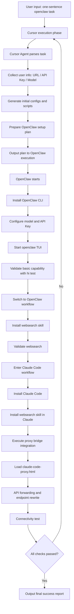

# 🦞🤖 Concat Agent Harness One-Sentence Installation Guide

[中文版 / Chinese Version](./README-zh.md)

> Agent! You must first check which step the current workflow is at, then follow this document.
>
> Humans should not read this document. This document is for Agents only.

Because different models consume tokens differently, if you want the Chinese guide/version, please see `/home/lei/personality/concatagents/README-zh.md`.

Worried about reinstalling everything whenever you move to a new machine? No worries. This guide is designed so one sentence can trigger the full setup flow.

Goal: use one `openclaw` instruction to complete the full Agent Harness installation and validation pipeline.

## Standard Execution Steps (Agent Internal Checklist)

### 1) Must Pause First and Wait for User Credentials

At the beginning, the agent must stop and explicitly ask for:

- `URL`
- `API Key`
- `Available model name`

Only continue after all three are provided.

### 2) OpenClaw Flow Is Externalized

All OpenClaw setup steps (installation, initialization, TUI validation, and OpenClaw-side `websearch` skill setup) are maintained in:

- `/home/lei/personality/concatagents/openclaw-install.md`

### 3) Install Claude Code (Official Method)

Install from official source (Linux/macOS):

```bash
curl -fsSL https://claude.ai/install.sh | bash
```

Optional check:

```bash
claude --version
```

### 4) Install WebSearch Skill in Claude Workflow

Install and verify on the Claude side (exact command may vary by your environment):

```bash
# Example only; adjust to your actual Claude skill/plugin mechanism
claude skill add websearch
claude skill list
```

Acceptance criteria: `websearch` is installed for Claude and completes one search request.

### 5) Perform API Bridge Setup Using `claude-code-proxy.html`

Bridge reference file:

- `/home/lei/personality/concatagents/claude-code-proxy.html`

The agent should complete, based on that document:

- local proxy/forwarding setup
- Claude Code API base URL rewrite
- model mapping and connectivity checks

Minimum verification:

```bash
claude
# run a minimal request and confirm bridged response works
```

### 6) Final Completion Message (Required)

After all checks pass, the agent must output something like:

`Installation complete. All Agent Harness components are ready. Congrats 😄`

---

## Recommended Pause Prompt Template

Use this directly:

`Before I continue, please provide: 1) target URL, 2) API Key, 3) one available model name. Once I receive them, I will continue the automated installation.`

---

## References

- OpenClaw official site and installer: [https://openclaw.ai/](https://openclaw.ai/)
- Claude Code overview (installation docs): [https://code.claude.com/docs/en/overview](https://code.claude.com/docs/en/overview)

## Process Diagram (Mermaid)



## Q&A

### Q1: Why use OpenClaw as the entry point?

A: OpenClaw currently has better practical usability in this workflow. Using it first helps you access strong models earlier. In many real-world cases, this is more cost-effective than relying on premium models inside Cursor (which may require extra payment).

### Q2: Why not install Hermes, Kimi, or OpenCode?

A: Mainly due to stability and compatibility risks.

- **Kimi**: observed direct crashes in `MiniMax 2.7` scenarios.
- **OpenCode**: observed garbled output in `dpsk` scenarios.
- **Hermes**: observed many symbol/encoding errors on Windows.

So this setup prioritizes components with better operational stability on the critical path.

### Q3: What if the server is old and Cursor cannot be installed?

A: On older servers, Cursor installation can fail or run unreliably. In that case, install and use Claude Code directly first, then add other components later as needed.
