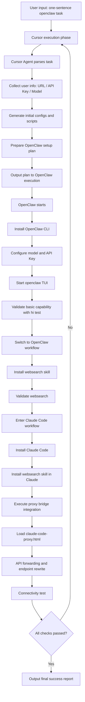

# 🦞🤖☤ Concat Agent Harness One-Sentence Installation Guide

[Agent requirement] You must ask the user to choose which agents to install before running any setup. Current options: `openclaw`, `claude code`, `hermes`.

[中文版 / Chinese Version](./README-zh.md)

> Agent! You must first check which step the current workflow is at, then follow this document.
>
> Humans should not read this document. This document is for Agents only.

If you want the Chinese guide, see [README-zh.md](./README-zh.md) in this directory.

Worried about reinstalling everything whenever you move to a new machine? No worries. This guide is designed so one sentence can trigger the full setup flow.

### Prerequisites

1. A [`model.json`](../model.json) **next to** the `concatagents/` directory (`../model.json` relative to this README), with **base URL(s)** and **API key** plus the model entries filled in (never commit real secrets to a public repo).

**Goal:** complete the full Agent Harness installation and validation pipeline from a single `openclaw`-style instruction, **without repeatedly blocking on human intervention**.

### Agent sign-off table (required)

At the end of the run, the executing agent must show the user a filled-in table **with the same columns as below** (`Yes` / `No` / `N/A`) **in the chat reply or hand-off notes**. **Do not** change or commit edits to the blank template in this README on disk—keep the file as-is and **only** paste the completed table to the user.

| Harness component | Installed | Verification passed | CLI OK (non-interactive smoke) |
|-------------------|-----------|----------------------|--------------------------------|
| OpenClaw | | | |
| Claude Code | | | |
| Hermes | | | |

## Standard Execution Steps (Agent Internal Checklist)

### 1) Hermes Installation Flow

For Hermes installation and usage setup, follow:

- [`hermes-guide.md`](./hermes-guide.md) (same directory as this README)

### 2) Install Claude Code (Official Method)

Install from official source (Linux/macOS):

```bash
curl -fsSL https://claude.ai/install.sh | bash
```

Prefer **Agent/automation-first** Claude Code first-run setup: for example rely on an exported **`ANTHROPIC_API_KEY`** (or equivalent) for headless/non-interactive auth, or use any officially scriptable login path if available. **Only if** self-login still fails and you cannot finish init by config/key rotation alone, pause and ask the user to run `claude` **once** locally for browser OAuth / first-run prompts. After init succeeds, continue the remaining steps.

Optional check:

```bash
claude --version
```

### 3) Install WebSearch Skill in Claude Workflow

Install and verify on the Claude side (exact command may vary by your environment):

```bash
# Example only; adjust to your actual Claude skill/plugin mechanism
claude skill add websearch
claude skill list
```

Acceptance criteria: `websearch` is installed for Claude and completes one search request.

### 4) Perform API Bridge Setup Using `claude-code-proxy.html`

Bridge reference file:

- [`claude-code-proxy.html`](./claude-code-proxy.html)

**Note:** Configure using the API key and URL the user provides.

The agent should complete, based on that document:

- local proxy/forwarding setup
- Claude Code API base URL rewrite
- model mapping and connectivity checks

Minimum verification:

```bash
claude
# run a minimal request and confirm bridged response works
```

### 5) Final Completion Message (Required)

After all checks pass, the agent must output something like:

`Installation complete. All Agent Harness components are ready. Congrats 😄`

---

## Recommended Pause Prompt Template

Use this directly:

`Before continuing, confirm ../model.json already has base URLs, API keys, and model entries; then specify which agents to install or enable among openclaw, Claude Code, and Hermes.`

---

## References

- OpenClaw official site and installer: [https://openclaw.ai/](https://openclaw.ai/)
- Claude Code overview (installation docs): [https://code.claude.com/docs/en/overview](https://code.claude.com/docs/en/overview)

## Process Diagram (Mermaid)



## Automated verification (Agent / CI)

The script [`scripts/verify-harness.sh`](./scripts/verify-harness.sh) runs non-interactively and does not print secrets. It reads `model.json` one directory up by default (override with `MODEL_JSON`). If `ANTHROPIC_API_KEY` or `MINIMAX_API_KEY` is exported, it also runs a `claude -p` end-to-end check. If `ANTHROPIC_BASE_URL` is **not** set, the script defaults it from `model.json` (`minimax-portal` first, then `minimax`) so China portal keys are not sent to the global host by mistake. Without any key, that step is SKIP (do not store secrets in `model.json` for the script to read—export them in the environment).

### Per-component smoke checks (no API keys / no live model)

With CLIs installed and on `PATH`, your **current working directory can be home (`~`) or anywhere** (for example open a terminal in `~`). Rows below except the harness are global commands. [`verify-harness.sh`](./scripts/verify-harness.sh) resolves `concatagents/` and the parent `model.json` from **the script’s own path**, so run it as `bash /path/to/repo/concatagents/scripts/verify-harness.sh`—you do **not** need to `cd` into `concatagents` first. The script checks binaries, `model.json`, optional local proxy syntax, and an anonymous MiniMax probe. Without exported keys, the live `claude -p` step is SKIP.

| Component | Command | Pass criterion |
|-----------|---------|----------------|
| Claude Code | `claude --version` | Prints one version line |
| OpenClaw | `openclaw --version` | Prints one OpenClaw version line |
| OpenClaw | `openclaw skills list` | Output contains `Skills` or column header `Skill` (newer CLI may print config warnings first) |
| Hermes | `hermes doctor` | Exit code `0` |
| Full harness (no API keys) | `bash /path/to/repo/concatagents/scripts/verify-harness.sh` (replace `/path/to/repo` with your clone; cwd may be `~`) or `cd /path/to/repo/concatagents` then `bash scripts/verify-harness.sh` | Exit code `0`; credential section is SKIP, `FAIL=0` |

### Full verification with API keys (still non-interactive)

After exporting keys in the environment, the same `verify-harness.sh` runs a real `claude -p` (about a 45s timeout). Do not put secrets in `model.json`; use `export` or CI secrets. Run the harness from **`~` or any cwd** using the script’s absolute path.

| Goal | Command | Pass criterion |
|------|---------|------------------|
| Harness + live model | `export MINIMAX_API_KEY='…'` or `export ANTHROPIC_API_KEY='…'`; optionally `export ANTHROPIC_BASE_URL='…'` (must match the key’s region); then `bash /path/to/repo/concatagents/scripts/verify-harness.sh` (same path rule; cwd may be `~`) | A `[OK]` line for the live `claude -p` step and the substring `PONG`; `FAIL=0`; credential section is **not** SKIP |
| Default endpoint / model | Export only the key, omit `ANTHROPIC_BASE_URL` / `ANTHROPIC_MODEL` | Script reads `baseUrl` and the tail of `defaultAgent.model.primary` from the parent `model.json` |

## End-to-end success criterion (automated)

The **only** acceptance bar is **fully automated, non-interactive** checks for every agent/model path you must cover: CLI exit codes, a clean [`verify-harness.sh`](./scripts/verify-harness.sh) run (`FAIL=0`), and—when keys are exported—the scripted live probes (for example the harness’s minimal `claude -p` ping). **If anything fails, the executor (Agent or CI) must read stdout/stderr and logs, fix the underlying misconfiguration or code, and re-run until all checks pass**—a manual “type hi in the UI” gate is **not** acceptable as a substitute.

## Q&A

### Q1: Why use OpenClaw as the entry point?

A: OpenClaw currently has better practical usability in this workflow. Using it first helps you access strong models earlier. In many real-world cases, this is more cost-effective than relying on premium models inside Cursor (which may require extra payment).

### Q2: Why not install Hermes, Kimi, or OpenCode?

A: Mainly due to stability and compatibility risks.

- **Kimi**: observed direct crashes in `MiniMax 2.7` scenarios.
- **OpenCode**: observed garbled output in `dpsk` scenarios.
- **OpenClaw**: observed runtime issues on Windows.

So this setup prioritizes components with better operational stability on the critical path.

### Q3: What if the server is old and Cursor cannot be installed?

A: On older servers, Cursor installation can fail or run unreliably. In that case, install and use Claude Code directly first, then add other components later as needed.
