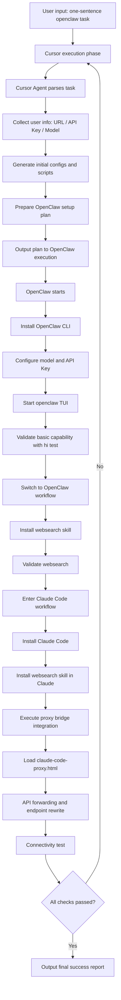

# 🦞🤖☤ Concat Agent Harness One-Sentence Installation Guide

[Agent requirement] You must ask the user to choose which agents to install before running any setup. Current options: `openclaw`, `claude code`, `hermes`.

[中文版 / Chinese Version](./README-zh.md)

> Agent! You must first check which step the current workflow is at, then follow this document.
>
> Humans should not read this document. This document is for Agents only.

If you want the Chinese guide, see [README-zh.md](./README-zh.md) in this directory.

Worried about reinstalling everything whenever you move to a new machine? No worries. This guide is designed so one sentence can trigger the full setup flow.

### Prerequisites

1. A [`model.json`](../model.json) **next to** the `concatagents/` directory (`../model.json` relative to this README), with **base URL(s)** and **API key** plus the model entries filled in (never commit real secrets to a public repo).

**Goal:** complete the full Agent Harness installation and setup flow from a single `openclaw`-style instruction, and finish in a state that can successfully pass [`verify/agent-model-repair`](./verify/agent-model-repair/) verification, **without repeatedly blocking on human intervention**.


## Standard Execution Steps (Agent Internal Checklist)

### 1) Hermes Installation Flow

For Hermes installation and usage setup, follow:

- [`hermes-guide.md`](./hermes-guide.md) (same directory as this README)

### 2) Install Claude Code (Official Method)

Install from official source (Linux/macOS):

```bash
curl -fsSL https://claude.ai/install.sh | bash
```

Prefer **Agent/automation-first** Claude Code first-run setup: for example rely on an exported **`ANTHROPIC_API_KEY`** (or equivalent) for headless/non-interactive auth, or use any officially scriptable login path if available. **Only if** self-login still fails and you cannot finish init by config/key rotation alone, pause and ask the user to run `claude` **once** locally for browser OAuth / first-run prompts. After init succeeds, continue the remaining steps.

Optional check:

```bash
claude --version
```

### 3) Install WebSearch Skill in Claude Workflow

Install and verify on the Claude side (exact command may vary by your environment):

```bash
# Example only; adjust to your actual Claude skill/plugin mechanism
claude skill add websearch
claude skill list
```

Acceptance criteria: `websearch` is installed for Claude and completes one search request.

### 4) Perform API Bridge Setup Using `claude-code-proxy.html`

Bridge reference file:

- [`claude-code-proxy.html`](./claude-code-proxy.html)

**Note:** Configure using the API key and URL the user provides.

The agent should complete, based on that document:

- local proxy/forwarding setup
- Claude Code API base URL rewrite
- model mapping and connectivity checks

Minimum verification:

```bash
claude
# run a minimal request and confirm bridged response works
```

### 5) Final Completion Message (Required)

After all checks pass, the agent must output something like:

`Installation complete. All Agent Harness components are ready. Congrats 😄`

---

## Recommended Pause Prompt Template

Use this directly:

`Before continuing, confirm ../model.json already has base URLs, API keys, and model entries; then specify which agents to install or enable among openclaw, Claude Code, and Hermes.`

---

## References

- OpenClaw official site and installer: [https://openclaw.ai/](https://openclaw.ai/)
- Claude Code overview (installation docs): [https://code.claude.com/docs/en/overview](https://code.claude.com/docs/en/overview)

## Process Diagram (Mermaid)



## Automated verification (Agent / CI)

For automated verification runs, the agent/CI flow should auto-invoke the following skills:

- `verify/agent-model-repair/`:
  Use this skill automatically whenever validation hits model/auth/endpoint failures (for example `401`, `400 unsupported`, broken model routing, or inconsistent OpenClaw / Claude / Hermes behavior). It should diagnose the failure, repair the local config path when possible, rerun the checks, and return the required Harness sign-off table in the chat or hand-off output.

Recommended trigger points:

- during automated verification when any provider/model check fails
- when cross-agent model availability is inconsistent


## Q&A

### Q1: Why use OpenClaw as the entry point?

A: OpenClaw currently has better practical usability in this workflow. Using it first helps you access strong models earlier. In many real-world cases, this is more cost-effective than relying on premium models inside Cursor (which may require extra payment).

### Q2: Why not install Hermes, Kimi, or OpenCode?

A: Mainly due to stability and compatibility risks.

- **Kimi**: observed direct crashes in `MiniMax 2.7` scenarios.
- **OpenCode**: observed garbled output in `dpsk` scenarios.
- **OpenClaw**: observed runtime issues on Windows.

So this setup prioritizes components with better operational stability on the critical path.

### Q3: What if the server is old and Cursor cannot be installed?

A: On older servers, Cursor installation can fail or run unreliably. In that case, install and use Claude Code directly first, then add other components later as needed.
